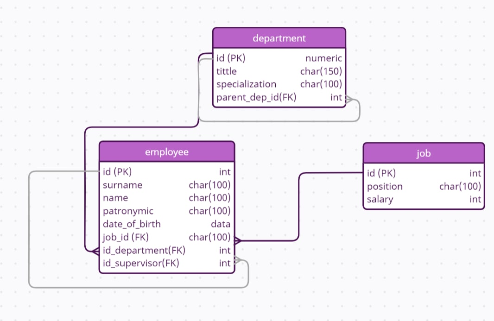
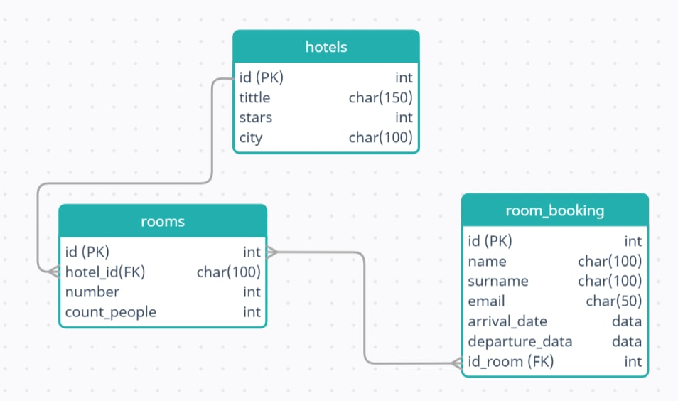

# Задание №1 (Проектирование базы данных)

Спроектировать и нарисовать схемы баз данных для хранения следующей информации:

1. Система бронирования отелей База должна содержать следующую информацию:

	- список отелей – название отеля, количество звезд и город, в котором он находится;
	- информацию о номерах в отеле – количество человек в номере;
	- фамилию, имя и email забронировавшего номер пользователя с указанием периода бронирования.

2. Адмнистративная структура компании База содержит следующую информацию:

	- список отделов* и их специализацию (бухгалтерия, логистический и т.д.);
	- список сотрудников.

	Для каждого сотрудника необходимо хранить: ФИО, дату рождения, должность, зарплату, отдел, в котором он работает, и его непосредственного руководителя. Для одинаковых должностей зарплата одинаковая.

Результатом работы являются две диаграммы баз данных При проектировании следует отмечать первичные и внешние ключи

\* Отделы имеют иерархическую структуру, т.е. отдел может быть часть какого-то другого отдела.

